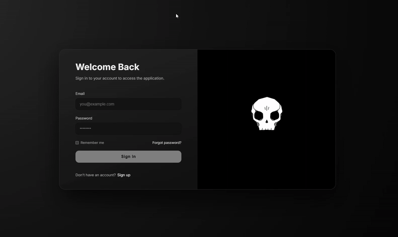

# 🎨 Login Page with Rive Animation



## 📝 About

A modern and beautiful dark-themed login page that uses **Rive** for interactive animations. This project provides a professional and engaging user interface for authentication systems.

## ✨ Features

- 🎭 Interactive animations with **Rive**
- 🌙 Modern dark design
- 📱 Fully responsive for all devices
- 🎨 Beautiful and professional UI
- ⚡ Fast and optimized performance

## 🛠️ Technologies Used

- **HTML5** - Page structure
- **CSS3** - Styling and design
- **JavaScript** - Logic and interactions
- **Rive** - Interactive animations

## 🚀 Getting Started

1. Clone or download the project:
```bash
git clone https://github.com/your-username/logi_page.git
```

2. Open the `index.html` file in your browser

Or you can use a local server:
```bash
# With Python
python -m http.server 8000

# With Node.js (http-server)
npx http-server
```

## 📁 Project Structure

```
logi_page/
├── index.html          # Main HTML file
├── styles.css          # CSS styles
├── app.js              # JavaScript logic and Rive
├── assets/
│   ├── Output.gif      # Project preview
│   └── 5593-10993-dagger-death-skull.riv  # Rive animation file
└── README.md           # This file
```

## 🎯 About Rive

This project uses [Rive](https://rive.app/) to create interactive animations. Rive is a powerful tool for building web animations that offers high performance and can be easily integrated into web projects.

## 📱 Compatibility

This login page works correctly on all modern browsers and different devices (desktop, tablet, mobile).

## 📧 Contact

You can reach me on Telegram:

**Telegram:** [@Faratar_flutter](https://t.me/Faratar_flutter)

---

## 📄 License

This project is available for free and open source.

---

**Made with ❤️ and Terio(https://t.me/Terio_team_ir)**

